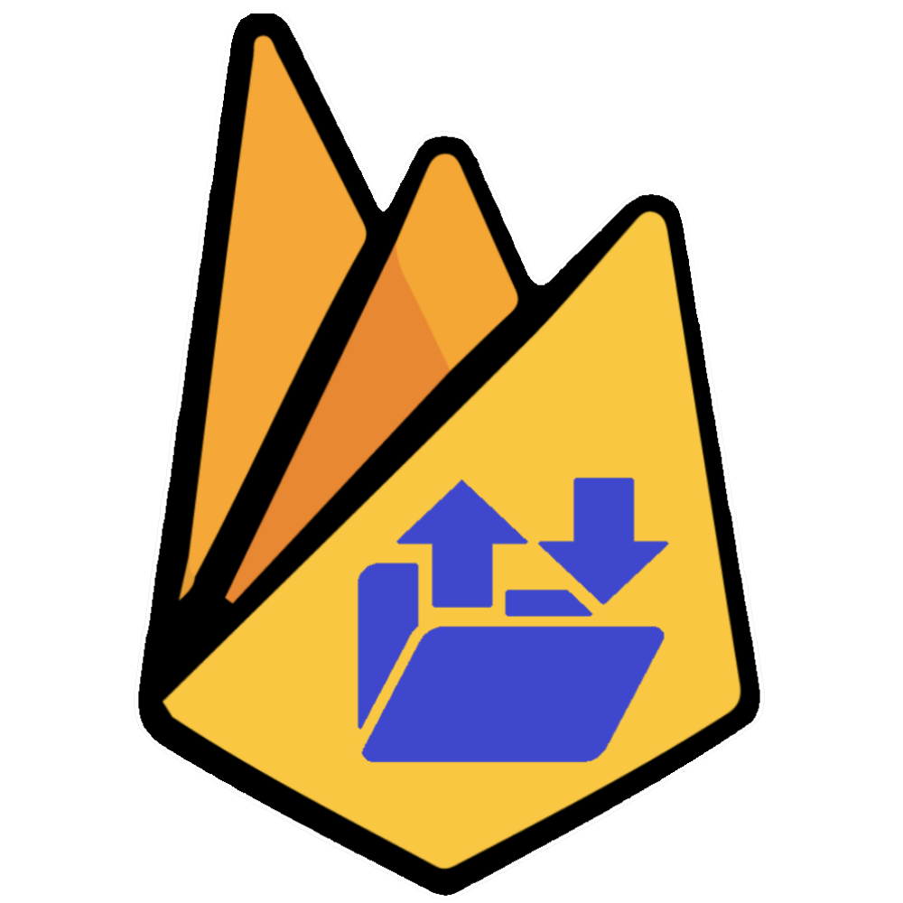

# My Transfer

[![Deployment status][site-shield]][site-url]
[![Next.js][nextjs-shield]][nextjs-url]
[![Firebase][firebase-shield]][firebase-url]
[![Tailwind CSS][tailwindcss-shield]][tailwindcss-url]


<div align="center">
  
</div>

## About the project

My Transfer is a web application that allows you to easily share files across your devices. Whether you want to send a photo to a friend or transfer important documents between your devices, My Transfer makes it quick and easy to do so.

Site is deployed using Vercel: [My-Transfer][site-url]

### Usage

To use My Transfer, simply drag and drop a file onto the app or click on the upload button to select a file. Once the file is uploaded, you will receive a unique link that you can share with anyone you want to share the file with. The link is valid for 24 hours, after which the file will be automatically deleted.

### PWA

The app is PWA enabled, which means you can install it on your device and use it as a native app. This is especially useful on mobile devices, where you can add the app to your home screen and use it as a standalone app.

### Built with

- Next.js 13 with experimental app directory
- Firebase v9 for backend storage and authentication
- Tailwind CSS for styling

## Getting Started

To get started with My Transfer, please follow the instructions below.

### Prerequisites

- Node.js v16.8.0 or later
- Firebase project with storage and authentication enabled

### Installation

Clone the repository and navigate to the project directory

```sh
git clone https://github.com/stianjsu/my-transfer.git
cd my-transfer
npm i
```

Set up Firebase configuration by creating a .env.local file in the root directory of the project and adding the following code:

```
NEXT_PUBLIC_FIREBASE_API_KEY=<your firebase API key>
NEXT_PUBLIC_FIREBASE_AUTH_DOMAIN=<your firebase auth domain>
NEXT_PUBLIC_FIREBASE_PROJECT_ID=<your firebase project id>
NEXT_PUBLIC_FIREBASE_STORAGE_BUCKET=<your firebase storage bucket>
NEXT_PUBLIC_FIREBASE_MESSAGING_SENDER_ID=<your firebase sender id>
NEXT_PUBLIC_FIREBASE_APP_ID=<your firebase app id>
```

Start the development server

```bash
npm run dev
```

Open http://localhost:3000 in your browser to see the app

## Limitations

As of now, the app has a file size limit of 100MB due to free tier limitations. The Storage Bucket only supports Firebase spark tier, which has a limit of 5GB of storage and 1GB of upload per day. This means that the app can only handle a limited amount of users and files.

## Acknowledgements

- [ducanh2912 for providing PWA ready package Next.js 13 with experimental app directory](https://github.com/DuCanhGH/next-pwa)

[nextjs-shield]: https://img.shields.io/badge/next.js-000000?style=for-the-badge&logo=nextdotjs&logoColor=white
[nextjs-url]: https://nextjs.org/
[firebase-shield]: https://img.shields.io/badge/Firebase-FFCC00?style=for-the-badge&logo=Firebase&logoColor=orange
[firebase-url]: https://firebase.google.com/
[tailwindcss-shield]: https://img.shields.io/badge/Tailwind_CSS-38B2AC?style=for-the-badge&logo=tailwind-css&logoColor=white
[tailwindcss-url]: https://tailwindcss.com/
[site-shield]: https://img.shields.io/github/deployments/stianjsu/my-transfer/production?label=vercel&logo=vercel&style=for-the-badge
[site-url]: https://my-transfer.vercel.app/
